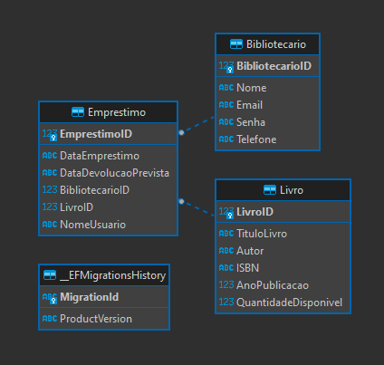

# Descrição do projeto

Este projeto foi desenvolvido com o objetivo de criar um sistema de gerenciamento de emprestimos de uma biblioteca. Nele é possível cadastrar bibliotecários, livros e gerar empréstimos.

# Para executar o projeto:

- Necessário ter Visual Studio ou similares;
- SQLite para gerenciamento do banco de dados;

# Relacionamento de banco de dados:

 

# Como rodar o projeto

- Clone o repositório ou faça o download do ZIP;
- Abra a solução ProjetoGerenciamentoRestaurante.sln no Visual Studio;
- Execute a aplicação utilizando o comando "./run.bat"

# Tecnologias utilizadas

- .NET Core 3.1
- Entity Framework Core 3.1
- ASP.NET Core MVC
- HTML
- CSS
- Bootstrap
- JavaScript
